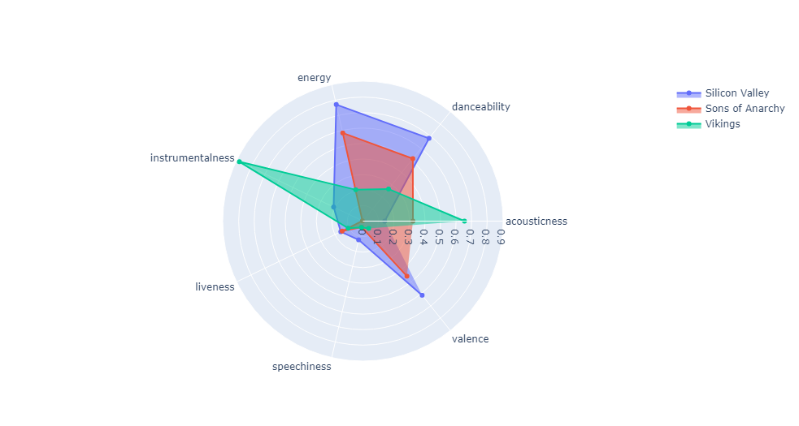

# TV Series and Song Matcher: Project Overview
I love watching tv series, and I give extra attention the song choices for the tv series I watch. Also, I love listening music, and sometimes I think that for a particular song could be a perfect for for particular TV Series. Therefore, I wonder if Machine Learning can decide that. In order to achieve this, I followed the steps: 
* Scraped all of the songs that is played on the TV Series from tunefind.com by using Selenium.
* I extracted the audio features of the songs from Spotify Developer API.
* I tried different classification algorithms to get the best performance. (Since this is a classification task) 
* Lastly, I productionarize the project with the Flask web framework and built some simple UI.
## Web Scraping
### Selenium tunefind.com
I wanted to make classification for the TV series Sons of Anarchy, Silicon Valley, and Vikings. Therefore, I scraped for these 3 TV Series from tunefind.com with the help of Selenium. Unfortunately, small portion of the songs were not included on the spotify so I couldn't ge to use them. 
### Spotify API
For every single song, requests has been made to the url https://api.spotify.com/v1/audio-features/{track-id}. Track ids are obtained from tunefind.com. Spotify api returns audio features for the particular track. Attributes are listed as below:
* danceability -> how suitable a track is for dancing based on a combination of musical elements including tempo, rhythm stability, beat strength, and overall regularity. 
* energy -> represents a perceptual measure of intensity and activity
* key -> The key the track is in. Integers map to pitches using standard Pitch Class notation. E.g. 0 = C, 1 = C♯/D♭, 2 = D, and so on. If no key was detected, the value is -1.
* loudness -> the overall loudness of a track in decibels (dB)
* mode -> Mode indicates the modality (major or minor) of a track, the type of scale from which its melodic content is derived. Major is represented by 1 and minor is 0.
* speechiness -> Speechiness detects the presence of spoken words in a track. The more exclusively speech-like the recording (e.g. talk show, audio book, poetry), the closer to 1.0 the attribute value.
* acousticness -> whether the track is acoustic
* instrumentalness -> predicts whether a track contains no vocals
* liveness -> higher liveness values represent an increased probability that the track was performed live.
* valence -> A measure from 0.0 to 1.0 describing the musical positiveness conveyed by a track.
* tempo -> The overall estimated tempo of a track in beats per minute (BPM)

For more detailed information you can visit https://developer.spotify.com/documentation/web-api/reference/#/operations/get-several-audio-features.
## Exploratory Data Analysis

## Model Building
## Application
